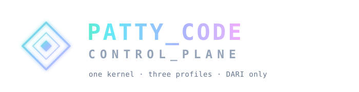

<p align="center">
  
</p>

<p align="center">
  <strong>한국어</strong>
  &nbsp;·&nbsp;
  <a href="./README.en.md">English</a>
</p>

<h3 align="center">AI 개발의 모든 행위를 보이게 하고, 통제하고, 증명합니다.</h3>

<p align="center">
  PCCP(Patty Code Control Plane)는 Patty Code 제품 전체가 함께 쓰는 운영 커널입니다.<br/>
  퍼블릭 클라우드와 엔터프라이즈, 공공·주권 배포가 같은 커널 위에서 실행되며,<br/>
  달라지는 것은 정책과 배포 형태뿐입니다.
</p>

## PCCP가 하는 일

PCCP는 LLM 게이트웨이 그 이상입니다. 누가 Patty Code를 쓰는지부터 어떤 모델을 쓸 수 있는지,
추론이 어디서 어떻게 실행되는지, 무엇을 증거로 남겨야 하는지까지 — 요청이 AI 인프라에 닿기 전에
거치는 모든 판단을 한곳에서 내립니다.

- **하나의 커널, 세 가지 프로필.** Patty Public Cloud · Enterprise · Government/Sovereign은
  같은 신원 모델과 DARI 계약, 스케줄러 원형을 공유합니다. 에디션별 코드 포크는 없습니다.
- **모델 발견의 권위는 서버에 있습니다.** 하네스에는 모델 목록도 공급자 URL 설정도 없습니다.
  인증 뒤에는 자격과 정책으로 걸러진 모델 카탈로그만 내려옵니다.
- **하네스 서비스 통신은 DARI 하나.** OpenAI·Anthropic 호환 경로나 REST 폴백은 공식 경로에
  존재하지 않습니다. 평범한 HTTP는 관리 API에만 씁니다.
- **컨트롤 플레인은 토큰 데이터 플레인이 아닙니다.** 릴레이와 스케줄러가 서명된 상태를 들고
  핫 패스를 처리하고, 이벤트는 비동기로 계량·보안·감사 시스템에 흘러갑니다.

## 아키텍처

```text
 개발자 머신                            PCCP                             추론 인프라
                          ┌────────────────────────────────┐
                          │  Control Plane          :8080  │
                          │  identity · catalog · policy   │
                          └───────────────┬────────────────┘
                                     signed hot state
                                          ▼
┌──────────────┐   DARI   ┌─────────┐        ┌───────────┐    DARI    ┌─────┐
│ Patty Code   │ ───────► │  Relay  │ ─────► │ Scheduler │ ─────────► │ PIA │ ──► vLLM · SGLang
│   Harness    │          │  :8090  │        │   :8455   │            │:9090│       GPU
└──────────────┘          └─────────┘        └───────────┘            └─────┘
```

릴레이가 하네스 트래픽을 받아 인증·정책 판정을 하고, 스케줄러가 KV 캐시 위치와 부하를 보고
워커를 고르며, PIA가 임대를 검증한 뒤 로컬 추론 엔진(vLLM·SGLang)으로 넘깁니다. 구간 사이는
전부 DARI(CBOR + COSE-Sign1, QUIC/TCP)입니다.

## 구성 요소

| 바이너리 | 기본 포트 | 역할 |
|---|---|---|
| `pccp-server` | `:8080` | 컨트롤 플레인. REST API + React 웹 콘솔. 조직·사용자·하네스·모델·정책 관리 |
| `pccp-relay` | `:8090` / `:8444` | 데이터 플레인 진입점. DARI 인증, 임대 검증, 정책 판정, 증거 발행 |
| `pccp-scheduler` | `:8455` / `:8445` | 모델 트래픽 디렉터. KV 캐시 인지 라우팅, prefill/decode 분리 실행, 카나리 출시, 리전 페일오버 |
| `pccp-pia` | `:9090` / `:9444` | 추론 에이전트. 임대 검증 후 vLLM·SGLang으로 요청을 프록시 |
| `pccp-bench` | — | F3 지연·스트리밍 벤치마크 |
| `pccp-alert-backfill` | — | 알림 엔드포인트 자격 증명을 암호화 저장소로 옮기는 이관 도구 |

## 무엇이 들어 있나

각 영역의 상세는 링크된 문서에 있습니다.

- **웹 콘솔 3종** — 접속 프로필에 따라 내비게이션과 화면이 완전히 바뀝니다. Patty Ops(서비스 운영),
  Enterprise(고객 관제), Account Portal(구독자 셀프 서비스). → [FEATURE_DOCUMENTATION](docs/FEATURE_DOCUMENTATION.md)
- **DARI 프로토콜** — 도구 호출·구조화 출력·멀티모달·캐시 회계까지 다루는 AI 시맨틱 v2와,
  독립 구현도 통과할 수 있는 적합성 시험 스위트. → [DARI.md](DARI.md) ·
  [프로토콜 스펙](docs/plans/DARI/DARI_Protocol_Specification_v1.0.md)
- **모델 스케줄러** — KV 캐시 위치를 아는 라우팅, prefill/decode 분리(P/D), 섀도 비교와 카나리
  임계치 기반 단계 출시, 데이터 레지던시를 지키는 리전 페일오버. →
  [PAT-1445 Router Evolution](docs/plans/2026-08-20-pat-1445-router-evolution-completion.md)
- **엔터프라이즈 거버넌스** — 조직·프로젝트·저장소 위계, DLP와 정책 에포크, Git과 연동된
  라인 단위 사람·AI 출처, 감사 증거. → [API_REFERENCE](docs/API_REFERENCE.md)
- **퍼블릭 클라우드 운영** — 구독·엔트라이틀먼트, 작업 슬롯 기반 공정 스케줄링, 계정 무결성과
  T&S 상태의 분리, SRE 콘솔. → [PRD v2 §10C](docs/pccp_v2/Patty_Code_Control_Plane_PCCP_PRD_v2.0.md)
- **주권 배포** — 로컬 PKI/KMS, 오프라인 카탈로그와 갱신, 폐쇄망 운영 프로파일. →
  [PRD v2 §1.3](docs/pccp_v2/Patty_Code_Control_Plane_PCCP_PRD_v2.0.md)

## 빠른 시작

필요한 것: Go 1.26+, Node.js 22+ 및 pnpm, SQLite(개발 기본) 또는 PostgreSQL 16+(운영)

```bash
make build        # pccp-server · pccp-relay · pccp-pia + 웹 콘솔
go build ./cmd/pccp-scheduler ./cmd/pccp-bench   # 나머지 바이너리

make dev-server   # 컨트롤 플레인 :8080
make dev-relay    # 릴레이 :8090
make dev-pia      # PIA :9090 (모의 엔진)
```

Docker로 띄우려면:

```bash
cd deployments/docker && docker compose up
```

http://localhost:8080 에 접속해 초기 관리자를 만듭니다.

- Email: `admin@patty.dev`
- Password: `changeme`

두 값은 `PCCP_ADMIN_EMAIL`, `PCCP_ADMIN_PASSWORD` 환경변수로 바꿀 수 있습니다.

## 개발

```bash
go test ./...                        # 전체 테스트
cd web && pnpm install && pnpm dev   # 웹 개발 서버 :8111 (:8080 프록시)
```

개발 기본 DB는 SQLite(`.data/` 아래)입니다. PostgreSQL로 전환하려면:

```bash
export PCCP_DB_DRIVER=postgres
export PCCP_DB_DSN="host=localhost port=5432 user=pccp password=pccp dbname=pccp sslmode=disable"
```

## 저장소 구조

```text
pccp/
├── cmd/                 바이너리 6종 — server · relay · pia · scheduler · bench · alert-backfill
├── internal/
│   ├── dari/            DARI 프로토콜 — CBOR, COSE-Sign1, QUIC/TCP 전송, AI 시맨틱 v2
│   ├── scheduler/       모델 스케줄러 — 라우팅, KV 인덱스, P/D 분리, 카나리, 리전
│   ├── relay/ · pia/    데이터 플레인 비즈니스 로직
│   ├── models/ · db/    GORM 도메인 모델과 데이터베이스 계층
│   ├── api/             REST 핸들러
│   ├── identity/ registry/ policy/ provenance/     커널 도메인
│   └── publiccloud/ billing/ metering/ workintel/ sovereign/ …   프로필 모듈
├── web/                 React 관리 콘솔
├── conformance/         DARI 적합성 시험
├── adapters/            vLLM · SGLang 어댑터
├── sdk/                 PIA SDK와 예제
├── registry/            프로토콜 레지스트리 — 메시지 · 프로파일 · 오류 · 암호
├── deployments/         Docker · Kubernetes 매니페스트
└── docs/                PRD, 스펙, 플랜, API 레퍼런스
```

## 문서

| 문서 | 내용 |
|---|---|
| [PRD v2.0](docs/pccp_v2/Patty_Code_Control_Plane_PCCP_PRD_v2.0.md) | 제품 전체 요구사항. v1과 충돌하면 이 문서가 우선 |
| [Master Plan](docs/MASTER_PLAN.md) | 문서 내비게이션 |
| [Current State](docs/CURRENT_STATE.md) | 현재 구현 상태 |
| [Implementation Status](docs/IMPLEMENTATION_STATUS.md) | 콘솔 화면별 진행도 |
| [Feature Documentation](docs/FEATURE_DOCUMENTATION.md) | 콘솔·하네스 기능 전체 |
| [API Reference](docs/API_REFERENCE.md) | REST API |
| [PAT-1445 Router Evolution](docs/plans/2026-08-20-pat-1445-router-evolution-completion.md) | 스케줄러 고도화 설계와 완료 기록 |

## 운영 원칙 (타협 없음)

1. **하나의 제품, 세 가지 프로필.** 정부용 코드 포크는 받아들이지 않습니다. 달라지는 것은 정책
   기본값과 배포 토폴로지이고, 코드는 같습니다.
2. **스키마가 UI보다 먼저.** PRD의 모든 엔티티는 대시보드가 그리기 전에 서명된 스키마로
   정의됩니다.
3. **수평 계층이 아니라 수직 슬라이스.** 증분은 아무리 작아도 하네스→릴레이→PIA→컨트롤
   플레인 끝까지 동작해야 합니다. "대시보드부터 다 만들기"는 없습니다.
4. **증거는 빌드의 일부.** 보호되는 동작은 그 구현과 같은 커밋에서 이벤트를 남깁니다. 나중에
   로깅을 붙이는 방식은 없습니다.
5. **적합성 시험은 프로토콜의 일부.** DARI에는 적합성 스위트가 따르고, 참조 구현은 이를 통과해야
   하며, 독립 구현도 통과할 수 있어야 합니다.
6. **오픈소스 경계를 지킵니다.** 열려야 할 것은 열려 있고, 닫혀야 할 것은 닫혀 있습니다. 신뢰
   경계는 코드 비공개가 아니라 서명된 모델 패키지와 엔드포인트 증명입니다.
7. **허상 컴플라이언스 금지.** 기능이 있다는 이유로 "CSAP 준수", "KISA 인증", "ISMS-P 인증"이라
   주장하지 않습니다. 우리가 만드는 것은 매핑과 증거이고, 인증은 고객의 절차입니다.
8. **프로토콜 트래픽에 HTTP/REST/WebSocket 금지.** 프로토콜은 QUIC과 TLS/TCP에 바인딩됩니다.
   네트워크가 QUIC을 막으면 REST가 아니라 TLS/TCP로 폴백합니다. HTTP API는 관리 전용입니다.
9. **하네스 변경은 하네스 저장소에서.** patty-code는 별도 저장소입니다. 하네스 파일을 이
   저장소에 스테이징하지 않습니다.
10. **인사 평가 자율 판단 금지.** Work Intelligence는 근거가 붙은 루브릭 점수까지만 제공합니다.
    실질적인 인사 결정에는 반드시 사람의 최종 확정 단계가 필요합니다.
